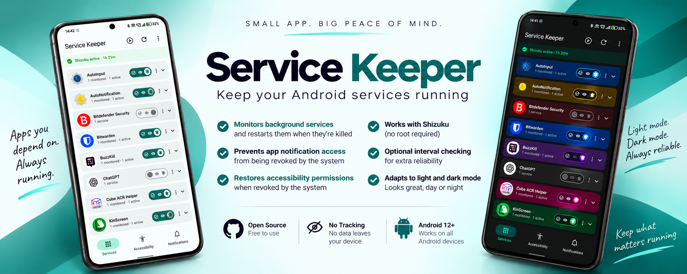

<p align="center">
  
</p>

<p align="center">
  <!-- Stack / Technical Chips -->
  
  
  
  <br/>
  <!-- Build / Activity -->
  <a href="https://github.com/sklndev/Service-Keeper/actions/workflows/build.yml"></a>
  
  
  <br/>
  <!-- Stars -->
  <a href="https://github.com/sklndev/Service-Keeper/stargazers"></a>
  <!-- Downloads -->
  <a href="https://github.com/sklndev/Service-Keeper/releases"></a>
  <br/>
  <!-- Distribution -->
  <a href="https://github.com/sklndev/Service-Keeper/releases/latest"></a>
  <a href="LICENSE"></a>
</p>

<p align="center">
  <a href="#-features">Features</a> •
  <a href="#-screenshots">Screenshots</a> •
  <a href="#-installation">Installation</a> •
  <a href="#-setup">Setup</a> •
  <a href="#-faq">FAQ</a> •
  <a href="#-contributing">Contributing</a>
</p>

---

An Android app that monitors and automatically restarts background services killed by the system. Built with Flutter and powered by [Shizuku](https://shizuku.rikka.app/) for privileged shell access.

> **AI Disclosure:** This project was built with significant AI assistance (Claude). All code has been reviewed and tested on a physical device (Android 16, API 36).

## 📋 Table of Contents

- [✨ Features](#-features)
- [📸 Screenshots](#-screenshots)
- [📥 Installation](#-installation)
- [⚙️ Setup](#️-setup)
- [🔧 Building from Source](#-building-from-source)
- [🔐 Permissions](#-permissions)
- [🛠️ How it Works](#️-how-it-works)
- [💻 Tech Stack](#-tech-stack)
- [❓ FAQ](#-faq)
- [🐛 Troubleshooting](#-troubleshooting)
- [🗺️ Roadmap](#️-roadmap)
- [🤝 Contributing](#-contributing)
- [💖 Support](#-support)
- [📄 License](#-license)

---

## ✨ Features

<table>
  <tr>
    <td align="center" width="33%">
      <br>
      <b>Auto Restart Services</b><br>
      <sub>Detects and restarts killed background services automatically</sub>
    </td>
    <td align="center" width="33%">
      <br>
      <b>Flexible Scheduling</b><br>
      <sub>Configurable intervals from 5 min to 4+ hours per service</sub>
    </td>
    <td align="center" width="33%">
      <br>
      <b>Complete Audit Log</b><br>
      <sub>Full timestamped history of every action and outcome</sub>
    </td>
  </tr>
  <tr>
    <td align="center" width="33%">
      <br>
      <b>Accessibility Monitoring</b><br>
      <sub>Re-enables accessibility services when revoked</sub>
    </td>
    <td align="center" width="33%">
      <br>
      <b>Notification Listeners</b><br>
      <sub>Monitors and re-enables notification listeners</sub>
    </td>
    <td align="center" width="33%">
      <br>
      <b>Boot Persistence</b><br>
      <sub>Auto-reschedules all monitors after reboot</sub>
    </td>
  </tr>
  <tr>
    <td align="center" width="33%">
      <br>
      <b>Smart App Relaunch</b><br>
      <sub>Restores your previous app after restart, with idle detection</sub>
    </td>
    <td align="center" width="33%">
      <br>
      <b>100% Private</b><br>
      <sub>No network permissions, no analytics, no ads, fully offline</sub>
    </td>
    <td align="center" width="33%">
      <br>
      <b>Free & Open Source</b><br>
      <sub>GPLv3 licensed, audit the code yourself</sub>
    </td>
  </tr>
</table>

### Key Capabilities

- 🔄 **Monitors background services** — detects when a selected service is killed and restarts it automatically
- ♿ **Monitors accessibility services** — re-enables them if Android revokes access in the background
- 🔔 **Monitors notification listeners** — re-enables if disabled by the system
- ⏱️ **Scheduled checks** — configurable per-service interval (5 min to 4+ hours)
- 📝 **Audit log** — full timestamped history of every detected stop, restart attempt, and outcome
- 🔁 **Boot persistence** — reschedules all monitors after device reboot
- 📢 **Per-app notifications** — toggle restart alerts per service
- 🎯 **Smart app relaunch** — when a service can only be recovered by relaunching its whole app, Service Keeper switches back to whatever you were doing afterward, and lets you control when that's allowed to happen (always, only when idle, only when locked, etc.)

---

## 📸 Screenshots

<p align="center">
  
  
  
  
</p>

<p align="center">
  
  
  
  
</p>

---

## 📥 Installation

Service Keeper is free and open source software, and is 100% offline (no network permissions, no analytics, no ads).

### Download Options

<p align="center">
  <a href="https://github.com/sklndev/Service-Keeper/releases/latest">
    
  </a>
</p>

| Method | Details | Status |
|--------|---------|--------|
| 📦 **[GitHub Releases](https://github.com/sklndev/Service-Keeper/releases)** | Download APK directly (universal or ABI-specific) | ✅ Available |
| 🔄 **[Obtainium](https://github.com/ImranR98/Obtainium)** | Add `https://github.com/sklndev/service_keeper` as source | ✅ Available |
| 🤖 **F-Droid** | Official F-Droid repository | 🔜 Pending submission |
| 📋 **IzzyOnDroid** | IzzyOnDroid F-Droid repo | 🔜 Pending submission |

> **Note:** Metadata for F-Droid/IzzyOnDroid submission is available in [`fastlane/metadata/android`](fastlane/metadata/android/en-US).

---

## ⚙️ Requirements

| Requirement | Details |
|---|---|
| Android | 8.0+ (API 26), tested on API 36 |
| [Shizuku](https://shizuku.rikka.app/) | Must be installed and running |
| ADB / Wireless Debugging | Required to start Shizuku |

Shizuku is a mandatory dependency. Without it, the app cannot execute privileged shell commands to restart services.

---

## 🚀 Setup

### 1. Install Shizuku

1. Install [Shizuku](https://play.google.com/store/apps/details?id=moe.shizuku.privileged.api) from the Play Store
2. Enable **Developer Options** on your device
3. Enable **Wireless Debugging** under Developer Options
4. Open Shizuku → tap **Pair using Wireless Debugging** and follow the prompts
5. Shizuku should now show as **Running**

### 2. Install Service Keeper

Install from a release APK or build from source (see below). On first launch, grant Shizuku permission when prompted. The app displays a status banner at the top when Shizuku is inactive.

### 3. Add services to monitor

Tap **+** on the Services tab → browse running services by app → select what you want to keep alive.

---

## 🔧 Building from Source

```bash
# Prerequisites: Flutter 3.x, Android SDK (minSdk 26, targetSdk 35)

git clone https://github.com/sklndev/service_keeper.git
cd service_keeper
flutter pub get
flutter run                          # debug on connected device
flutter build apk --release          # release APK
flutter build appbundle --release    # Play Store bundle
```

---

## 🔐 Permissions

| Permission | Reason |
|---|---|
| `FOREGROUND_SERVICE` | Background monitoring service |
| `QUERY_ALL_PACKAGES` | Enumerate installed services for the picker |
| `POST_NOTIFICATIONS` | Restart event alerts |
| `RECEIVE_BOOT_COMPLETED` | Restore monitors after reboot |
| `WAKE_LOCK` + `REQUEST_IGNORE_BATTERY_OPTIMIZATIONS` | Prevent Doze from deferring checks |

---

## 🛠️ How it Works

**Shizuku bridge**
All privileged operations go through a single `MethodChannel` (`com.shaunkleyn.service_keeper/shizuku`). Kotlin receives calls, spawns a Shizuku process, runs the shell command, and returns stdout to Dart.

Shell commands used:
- `dumpsys activity services [pkg]` — detect running services
- `am start-foreground-service -n pkg/.Class` — restart a service
- `am force-stop pkg` — hard stop before restart

**Scheduling**
- Interval ≥ 15 min → `WorkManager` periodic task (battery-efficient)
- Interval < 15 min → self-chaining one-off tasks (re-schedules itself after each run)
- `BootReceiver` restores all schedules from SharedPreferences on `BOOT_COMPLETED`

**Service detection**
Parses `dumpsys activity services` output with a regex that handles both standard and Android 16 output format (which appends ` c:<caller>` before `}`).

**App relaunch and idle detection**
When a service can only be recovered by relaunching its whole app, Service Keeper captures the currently foregrounded app first, launches the target, waits briefly, then switches back to what you were on. Whether that's allowed to happen right away depends on the configured mode:
- No app open: compares the foreground app against the resolved launcher/home package
- No activity for a while: reads `PowerManager`'s activity timer straight from `dumpsys power`, since taps and scrolls reset that timer directly, unlike `UsageEvents`, which doesn't fire reliably during ongoing scrolling
- When locked: checks `KeyguardManager.isKeyguardLocked`, and defers via a small queue that drains on the next `ACTION_USER_PRESENT` broadcast

A blocked relaunch is queued and retried automatically once the device becomes idle, so nothing silently gets skipped.

---

## 💻 Tech Stack

- **Flutter** — UI and app logic
- **Kotlin** — Android native bridge (Shizuku, WorkManager, icon/name lookup)
- **Shizuku** — Privileged shell execution without root
- **WorkManager** — Background task scheduling
- **sqflite** — Audit event persistence
- **flutter_local_notifications** — Restart alerts
- **palette_generator** — Dynamic app colors extracted from icons

---

## ❓ FAQ

<details>
<summary><b>Does this app require root access?</b></summary>

No! Service Keeper uses Shizuku for privileged access, which doesn't require root. Shizuku can be started via wireless debugging (ADB) on any Android device.
</details>

<details>
<summary><b>Will this drain my battery?</b></summary>

Battery usage is minimal. Service Keeper uses WorkManager for efficient background scheduling and only performs lightweight checks at configurable intervals (5min-4hrs). The app respects Android's Doze mode while preventing check deferrals with wake locks.
</details>

<details>
<summary><b>Why do I need Shizuku?</b></summary>

Android's security model prevents regular apps from restarting services or re-enabling accessibility services. Shizuku provides a bridge to execute these privileged operations without requiring root access.
</details>

<details>
<summary><b>Does this collect any data?</b></summary>

No. Service Keeper has zero network permissions and operates 100% offline. All data stays on your device. You can verify this in the source code or by checking the app's permissions.
</details>

<details>
<summary><b>Can I monitor system services?</b></summary>

Service Keeper focuses on third-party app services. System services are managed by Android itself and generally shouldn't need external monitoring.
</details>

<details>
<summary><b>What happens if Shizuku stops running?</b></summary>

The app will display a banner notification and won't be able to restart services until Shizuku is restarted. Scheduled checks continue running and will resume operations once Shizuku is available.
</details>

<details>
<summary><b>Does this work with all apps?</b></summary>

Most apps work fine, but some apps with aggressive self-protection or special system configurations may not respond to standard restart commands. The audit log will show any failures.
</details>

---

## 🐛 Troubleshooting

### Shizuku won't stay running

**Solution:** Enable **Start on Boot** in Shizuku settings. If your device has aggressive battery optimization, add Shizuku to the battery optimization whitelist.

### Services aren't being restarted

1. **Check Shizuku status** — ensure it's running (green banner in Service Keeper)
2. **Review audit log** — check for error messages explaining why restart failed
3. **Verify service is actually stopped** — use Settings → Developer Options → Running Services
4. **Try manual restart** — tap the refresh button in Service Keeper to force a check
5. **Increase check interval** — some services may need time to stabilize before monitoring

### App keeps crashing

1. **Update to latest version** — check [Releases](https://github.com/sklndev/Service-Keeper/releases)
2. **Clear app data** — Settings → Apps → Service Keeper → Storage → Clear Data
3. **Check Android version** — minimum API 26 (Android 8.0) required
4. **Report the issue** — [open a GitHub issue](https://github.com/sklndev/Service-Keeper/issues) with crash details

### Battery optimization warnings

Service Keeper needs to run in the background. If your device aggressively kills background apps:

1. **Disable battery optimization** for Service Keeper (Settings → Battery → Battery Optimization)
2. **Add to auto-start whitelist** (varies by manufacturer)
3. **Lock app in recents** (available on some devices)

### Wireless debugging disconnects frequently

Some devices disconnect wireless debugging when the screen is off. Solutions:

1. **Use USB debugging** instead of wireless (requires cable to start Shizuku each boot)
2. **Root and use Shizuku in root mode** (if you prefer root)
3. **Enable "Stay awake" in Developer Options** when starting Shizuku

---

## 🗺️ Roadmap

Planned features and improvements:

- [ ] **Export/import monitoring configuration** — backup and restore your service list
- [ ] **Per-service success/failure statistics** — track reliability over time
- [ ] **Custom restart commands** — advanced users can specify alternative restart methods
- [ ] **Tasker/automation integration** — trigger monitoring via external events
- [ ] **Widget support** — quick status view and manual trigger from home screen
- [ ] **Dark theme variants** — multiple AMOLED-friendly themes
- [ ] **Notification grouping** — better organization for multiple service alerts
- [ ] **Advanced filtering in audit log** — search by service, time range, outcome
- [ ] **Service dependency chains** — automatically restart dependent services in order
- [ ] **F-Droid listing** — official F-Droid and IzzyOnDroid availability

> Have a feature request? [Open an issue](https://github.com/sklndev/Service-Keeper/issues) with the `enhancement` label!

---

## 🤝 Contributing

Contributions are welcome! Here's how you can help:

### Ways to Contribute

- 🐛 **Report bugs** — [open an issue](https://github.com/sklndev/Service-Keeper/issues/new) with detailed steps to reproduce
- 💡 **Suggest features** — share your ideas in the [issues](https://github.com/sklndev/Service-Keeper/issues)
- 📝 **Improve documentation** — fix typos, clarify instructions, add examples
- 🌍 **Translate** — help localize the app (currently English only)
- 💻 **Submit code** — fork, make changes, and open a pull request

### Development Setup

1. Fork the repository
2. Clone your fork: `git clone https://github.com/YOUR_USERNAME/Service-Keeper.git`
3. Create a feature branch: `git checkout -b feature/amazing-feature`
4. Make your changes and test thoroughly on a physical device
5. Commit with clear messages: `git commit -m 'Add amazing feature'`
6. Push to your fork: `git push origin feature/amazing-feature`
7. Open a Pull Request

### Code Style

- Follow existing Dart/Kotlin conventions
- Add comments for complex logic
- Test on physical devices (emulators don't support Shizuku)
- Update documentation if needed

### Testing

All changes should be tested on a real Android device with Shizuku before submitting.

---

## 💖 Support

If you find Service Keeper useful, please consider:

<p align="center">
  <a href="https://github.com/sklndev/Service-Keeper/stargazers">
    
  </a>
</p>

- ⭐ **Star the repository** — helps others discover the project
- 🐛 **Report bugs** — help improve stability
- 💡 **Share feature ideas** — guide future development
- 📢 **Spread the word** — tell others who might benefit
- 🤝 **Contribute code** — PRs are always welcome!

### Acknowledgments

- **[Shizuku](https://github.com/RikkaApps/Shizuku)** — for making privileged operations possible without root
- **Claude (Anthropic)** — AI pair programming assistant used during development
- **Flutter & Kotlin communities** — for excellent frameworks and tools

---

## 🤖 AI Disclosure

This project was prototyped and developed with heavy use of Claude (Anthropic). The development approach is commonly called "vibe coding" — iterating rapidly with an AI pair programmer. All generated code was tested on a physical device before shipping. If you find bugs, [open an issue](https://github.com/sklndev/Service-Keeper/issues).

---

## 📄 License

[GNU General Public License v3.0 or later](LICENSE)

```
Copyright © 2025 Shaun Kleyn

This program is free software: you can redistribute it and/or modify
it under the terms of the GNU General Public License as published by
the Free Software Foundation, either version 3 of the License, or
(at your option) any later version.

This program is distributed in the hope that it will be useful,
but WITHOUT ANY WARRANTY; without even the implied warranty of
MERCHANTABILITY or FITNESS FOR A PARTICULAR PURPOSE. See the
GNU General Public License for more details.
```

---

<p align="center">
  Made with ❤️ and 🤖 • <a href="https://github.com/sklndev/Service-Keeper/issues/new?labels=bug">Report Bug</a> • <a href="https://github.com/sklndev/Service-Keeper/issues/new?labels=enhancement">Request Feature</a>
</p>

<p align="center">
  <sub>Built with Flutter • Powered by Shizuku • Enhanced by Claude</sub>
</p>
